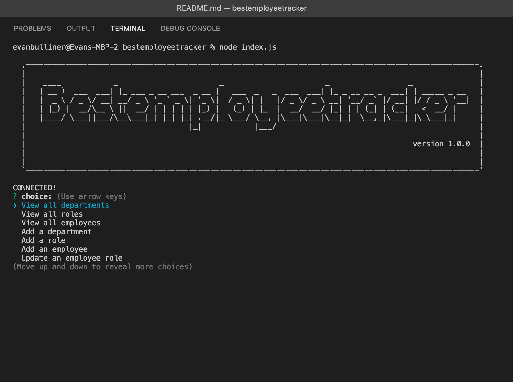

  Best Employee Tracker Ever! 

  I made a pretty cool Employee Tracker. When the user types in "node index.js" on their terminal, the user will be presented with options. You can scroll through using the arrows on your keyboard to see the options and press the return key to make your selection. You can add values by using the "Add" option. You can add a department, role, or employee to their respective tables. 
  
  The user will just need to follow the prompts given to add values to the tables. You can update an employees role by using the "Update an employee role" option. When you are finished with making your updates on this app, the user will use the "Exit" option and the app will terminate and you will return to your terminal. Thank you for your time and using my app!
  # Table of Contents:
  * [Installation](#installation)
  * [Usage](#usage)
  * [Contributing](#contributing)
  * [Tests](#tests)
  * [Questions](#questions)
  * [License](#license)
---

  ## Video:
  Link to video on how the app works: https://watch.screencastify.com/v/3tmQJITQrwVyiuPthHLp

  ## Installation:
  Run schema.sql & seed.sql on mysql. Then type "node index.js" in terminal
  ## Usage:
  This app will help you keep track of your employees, roles, and departments.
  ## Contributing:
  No specific guidelines to follow
  ## Tests:
  Instructions are in the installation
  ## Questions:
  For any further assistance, you may contact me at:
  * Github: [ebulliner](<https://github.com/ebulliner>)
  OR
  * Email: evan_bulliner@yahoo.com
  ---
  ___
# License
  ## MIT
  This project is licensed under the [MIT License](https://opensource.org/licenses/MIT).

## Screenshots

